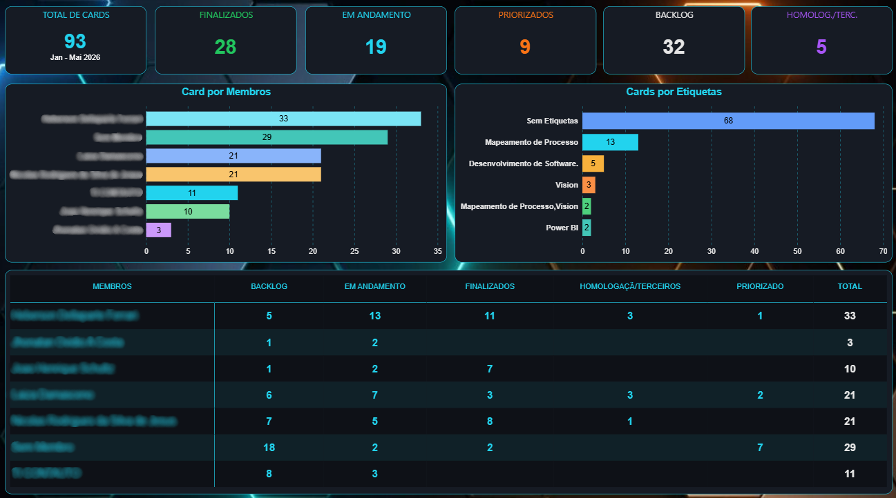

# Dashboard de Gestão de Projetos — Trello

## Sobre o projeto

Dashboard desenvolvido para acompanhamento e análise da organização de projetos do **Setor de Informática**, utilizando dados provenientes do Trello.

O projeto tem como objetivo proporcionar uma visão consolidada do andamento das atividades da equipe, permitindo acompanhar a distribuição das tarefas, o progresso dos projetos e a carga de trabalho dos colaboradores.

A solução utiliza conceitos de **metodologia ágil** para auxiliar no acompanhamento do fluxo de trabalho e na identificação de atividades pendentes, em andamento e concluídas.

---

## Dashboard



---

## Objetivos

- Centralizar informações relacionadas aos projetos e atividades da equipe.
- Acompanhar o andamento das tarefas.
- Visualizar a distribuição das atividades entre os colaboradores.
- Identificar tarefas pendentes e em andamento.
- Acompanhar a evolução dos projetos.
- Auxiliar na identificação de possíveis gargalos no fluxo de trabalho.
- Apoiar o planejamento e a tomada de decisões da equipe.

---

## Principais indicadores

### Projetos

- Total de projetos
- Projetos em andamento
- Projetos concluídos
- Projetos pendentes

### Tarefas

- Total de tarefas
- Tarefas concluídas
- Tarefas em andamento
- Tarefas pendentes
- Tarefas atrasadas

### Equipe

- Quantidade de tarefas por colaborador
- Tarefas concluídas por colaborador
- Tarefas em andamento por colaborador
- Distribuição da carga de trabalho

---

## Metodologia

O projeto utiliza conceitos de **metodologia ágil** para organização e acompanhamento das atividades.
O fluxo de trabalho é representado por etapas que permitem acompanhar a evolução das tarefas desde sua criação até sua conclusão.

```text
Backlog
   ↓
Priorizado
   ↓
Em Andamento
   ↓
Homologação
   ↓
Finalizados
