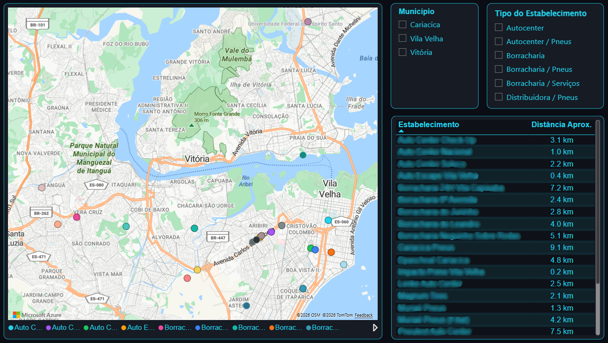

# Dashboard de Pontos de Consumo

## Sobre o projeto

Dashboard desenvolvido para visualização e análise de **pontos de consumo localizados em um raio de até 15 km**, considerando estabelecimentos e empresas que podem representar clientes ou oportunidades de parceria comercial.

O projeto tem como objetivo facilitar a identificação e localização desses estabelecimentos, permitindo uma análise rápida da distribuição dos pontos de consumo e de sua proximidade.

---

[!WARNING]
**Aviso:** Os dados apresentados neste projeto foram anonimizados ou adaptados para fins de demonstração, preservando informações internas e confidenciais.

---

## Dashboard



---

## Funcionalidades

O dashboard apresenta uma visão geográfica dos pontos de consumo e permite filtrar as informações de acordo com diferentes critérios.

### Mapa

Visualização geográfica dos estabelecimentos localizados dentro do raio de **15 km**.

### Filtro por município

Permite selecionar o município para visualizar somente os pontos de consumo pertencentes à região escolhida.

### Filtro por tipo de estabelecimento

Permite segmentar os pontos de consumo de acordo com seu tipo de estabelecimento.

### Tabela de estabelecimentos

Apresenta informações detalhadas dos pontos de consumo, incluindo:

- Razão social
- Distância aproximada

---

## Análise

A ferramenta permite identificar rapidamente:

- Estabelecimentos localizados dentro do raio de 15 km.
- Distância aproximada de cada estabelecimento.
- Distribuição dos pontos de consumo por município.
- Distribuição dos estabelecimentos por tipo.
- Possíveis clientes e parceiros comerciais próximos.

---

## Visualização Geográfica

A análise é baseada na localização dos estabelecimentos em relação ao ponto de referência definido.

```text
             Estabelecimento
                    ●
                  ↗
                ↗
              ↗
            ↗
          ● ─────────────── ●
       Ponto de           Estabelecimento
       referência
          <── 15 km ──>
