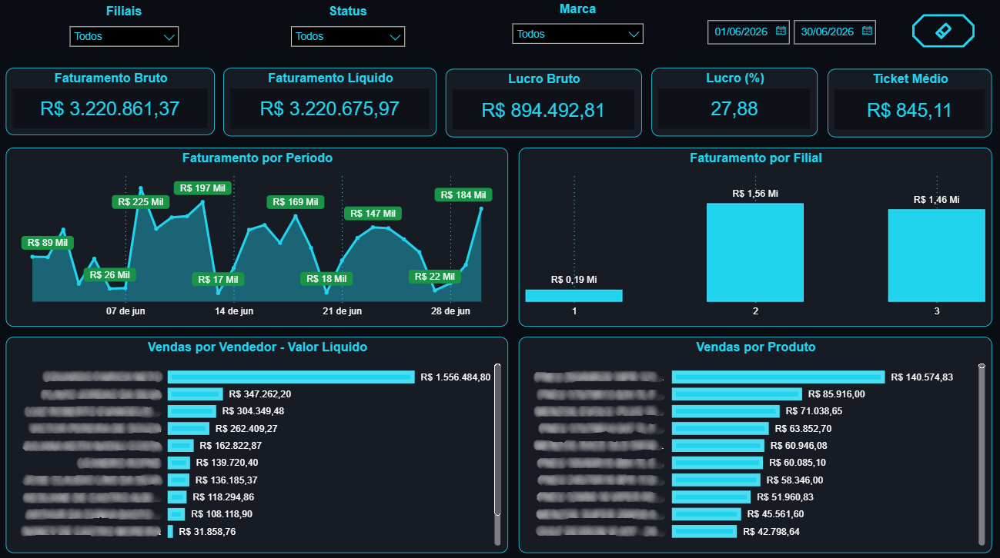
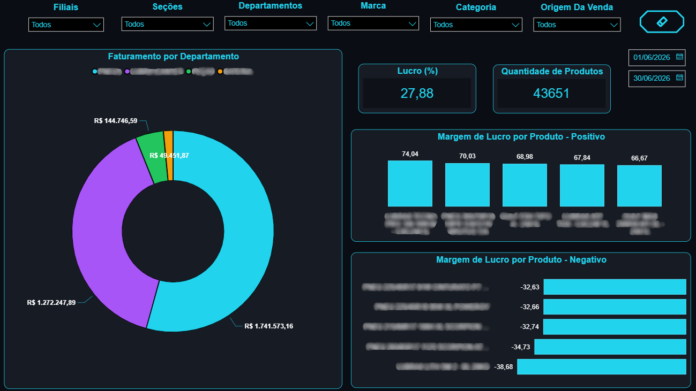
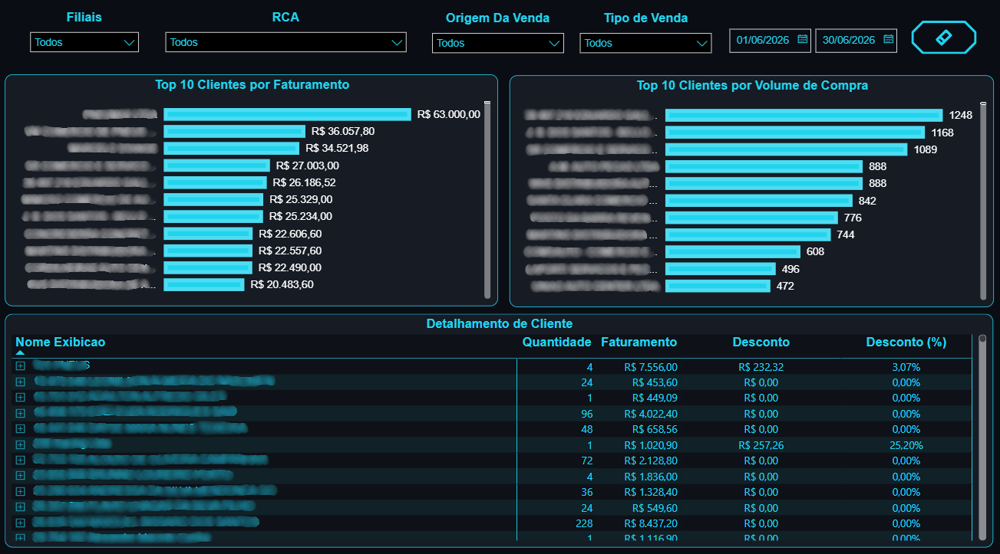
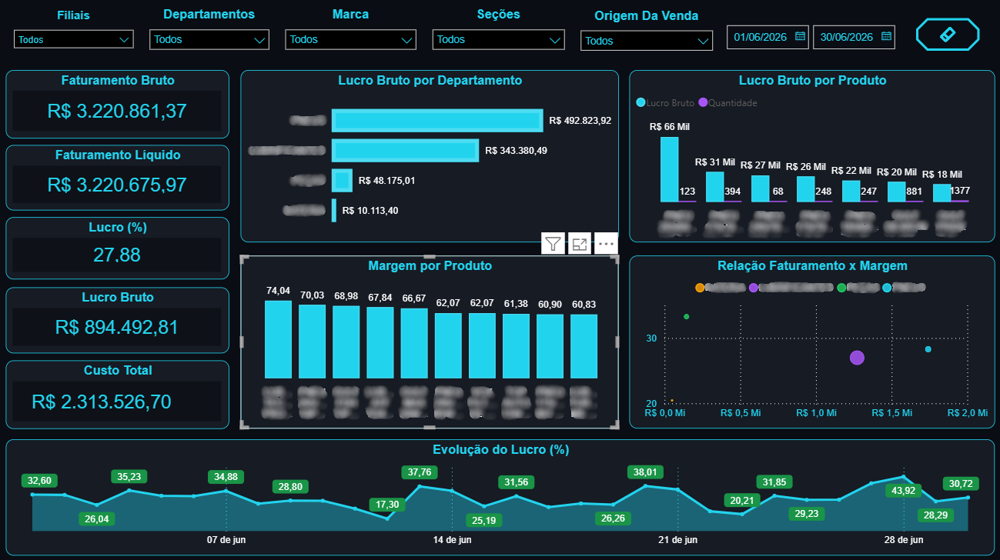
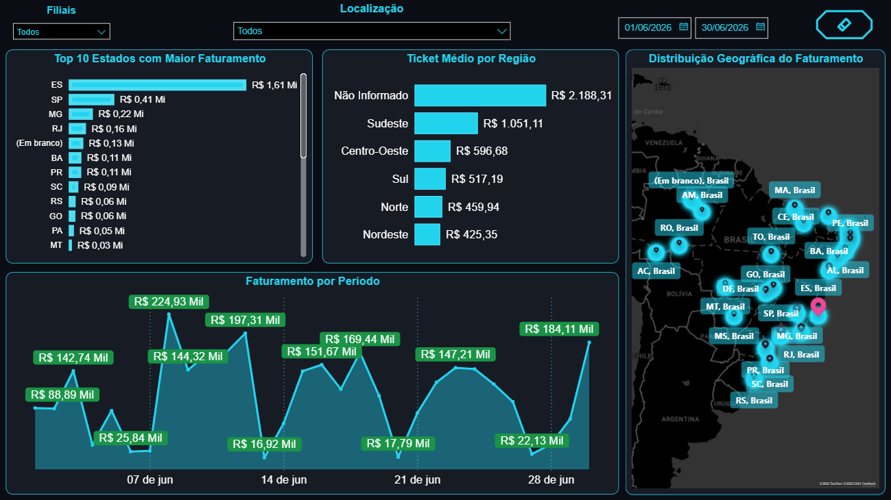

# Dashboard de Análise Comercial e Rentabilidade

## Sobre o projeto

Dashboard desenvolvido para análise integrada do desempenho comercial, permitindo acompanhar indicadores de **faturamento, vendas, produtos, clientes, rentabilidade e distribuição geográfica**.

O projeto foi estruturado em cinco páginas analíticas, proporcionando diferentes perspectivas sobre os resultados da operação e permitindo uma análise detalhada do desempenho comercial.

---

> [!WARNING]
> **Aviso:** Os dados apresentados neste projeto foram anonimizados ou adaptados para fins de demonstração, preservando informações internas e confidenciais.

---

## Dashboard

### Visão Executiva



### Produtos



### Clientes



### Rentabilidade



### Geográfico



---

## Estrutura do Dashboard

O dashboard é dividido em cinco páginas:

- **Visão Executiva**
- **Produtos**
- **Clientes**
- **Rentabilidade**
- **Geográfico**

---

# 1. Visão Executiva

A página de **Visão Executiva** apresenta uma visão geral do desempenho comercial por meio dos principais indicadores e análises de vendas.

### Indicadores

- Faturamento Bruto
- Faturamento Líquido
- Lucro Bruto
- Lucro (%)
- Ticket Médio

### Visualizações

**Faturamento por Período**
Gráfico de linha utilizado para acompanhar a evolução do faturamento ao longo do período analisado.

**Faturamento por Filial**
Gráfico de colunas utilizado para comparar o faturamento entre as diferentes filiais.

**Vendas por Vendedor**
Gráfico de barras para análise do desempenho de vendas por vendedor.

**Vendas por Produto**
Gráfico de barras para identificação dos produtos com maior volume de vendas.

---

# 2. Produtos

A página de **Produtos** apresenta uma análise direcionada ao desempenho dos produtos comercializados e suas respectivas margens de lucro.

### Indicadores

- Lucro (%)
- Quantidade de Produtos Vendidos

### Visualizações

**Faturamento por Departamento**
Gráfico de rosca utilizado para visualizar a distribuição do faturamento entre os departamentos.

**Margem de Lucro por Produto — Positivo**
Gráfico de colunas para identificação dos produtos com margem de lucro positiva.

**Margem de Lucro por Produto — Negativo**
Gráfico de barras para identificação dos produtos que apresentam margem de lucro negativa.

Essa análise permite identificar produtos com diferentes níveis de rentabilidade e apoiar análises relacionadas ao desempenho do portfólio.

---

# 3. Clientes

A página de **Clientes** apresenta uma visão sobre o comportamento da carteira de clientes e sua participação no faturamento e volume de compras.

### Visualizações

**Top 10 Clientes por Faturamento**
Gráfico de barras apresentando os dez clientes com maior faturamento.

**Top 10 Clientes por Volume de Compra**
Gráfico de barras apresentando os dez clientes com maior volume de compras.

**Detalhamento de Cliente**
Matriz utilizada para análise detalhada das informações relacionadas aos clientes.

Essa página permite identificar os principais clientes da operação e analisar sua participação nos resultados comerciais.

---

# 4. Rentabilidade

A página de **Rentabilidade** concentra os principais indicadores relacionados ao resultado financeiro da operação.

### Indicadores

- Faturamento Bruto
- Faturamento Líquido
- Lucro (%)
- Lucro Bruto
- Custo Total

### Visualizações

**Lucro Bruto por Departamento**
Gráfico de barras utilizado para comparar o lucro bruto entre os departamentos.

**Lucro Bruto por Produto**
Gráfico de colunas para análise do lucro bruto gerado individualmente pelos produtos.

**Margem (%) por Produto**
Gráfico de colunas utilizado para comparação das margens de lucro dos produtos.

**Evolução do Lucro (%)**
Gráfico de linha utilizado para acompanhar a evolução percentual do lucro ao longo do período analisado.

Essa página permite avaliar não apenas o volume de vendas, mas também a capacidade de geração de resultado da operação.

---

# 5. Geográfico

A página de **Geográfico** apresenta uma visão territorial do desempenho comercial.

### Visualizações

**Top 10 Estados com Maior Faturamento**
Gráfico de barras utilizado para identificar os estados com maior participação no faturamento.

**Ticket Médio por Região**
Gráfico de barras utilizado para comparar o ticket médio entre as diferentes regiões.

**Faturamento por Período**
Gráfico de linha utilizado para acompanhar a evolução do faturamento ao longo do tempo.

**Distribuição Geográfica do Faturamento**
Mapa utilizado para visualizar a distribuição do faturamento geograficamente.

---

# Principais análises

O dashboard permite analisar diferentes dimensões do negócio, incluindo:

- Evolução do faturamento ao longo do tempo.
- Comparação de faturamento entre filiais.
- Desempenho de vendedores.
- Desempenho de produtos.
- Distribuição do faturamento por departamento.
- Identificação de produtos com margens positivas e negativas.
- Identificação dos principais clientes.
- Análise de volume de compras por cliente.
- Análise de custos e rentabilidade.
- Evolução da margem de lucro.
- Comparação de desempenho entre estados e regiões.
- Distribuição geográfica do faturamento.

---

# Indicadores principais

| Indicador | Descrição |
|---|---|
| Faturamento Bruto | Valor total das vendas antes das deduções consideradas |
| Faturamento Líquido | Valor das vendas após as deduções consideradas |
| Lucro Bruto | Resultado obtido após a consideração dos custos utilizados no cálculo |
| Lucro (%) | Percentual de lucro em relação ao faturamento |
| Ticket Médio | Valor médio das vendas |
| Custo Total | Total dos custos considerados na análise |
| Quantidade de Produtos Vendidos | Quantidade total de produtos comercializados |

---

# Tecnologias utilizadas

- Power BI
- SQL
- Modelagem de dados
- Tratamento de dados
- Visualização de dados
- Análise de indicadores

---

# Estrutura Analítica

O dashboard foi organizado de forma a permitir uma análise progressiva dos resultados:

```text
Visão Executiva
       ↓
   Produtos
       ↓
   Clientes
       ↓
 Rentabilidade
       ↓
  Geográfico
